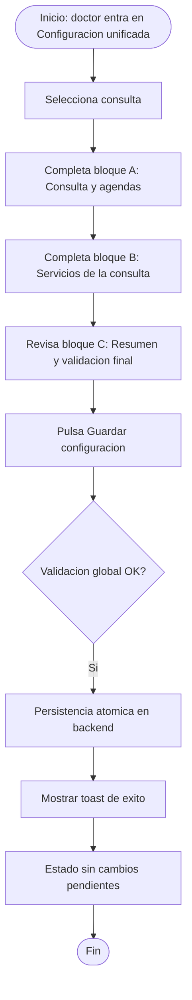
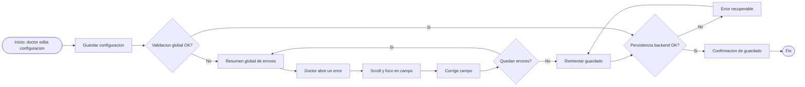

# Mejoras configuracion agendas y citas

## Descripcion funcional

### Metadatos

- Fecha de creacion: 2026-04-23
- Responsable negocio: [Pendiente]
- Responsable funcional: [Pendiente]
- PO: [Pendiente]
- Responsable UX: [Pendiente]
- Prioridad (Q): Alta
- Tipo: Mejora
- Trimestre objetivo: Q2

### Descripcion general de la funcionalidad

La configuracion actual de agendas y citas en Backoffice Doctor exige navegar entre dos secciones separadas (`Servicios` y `Consultas y agendas`) y ejecutar multiples guardados intermedios para completar una misma configuracion operativa. Esto genera friccion cognitiva, errores de configuracion y abandono del flujo antes de publicar disponibilidad online.

La mejora propone unificar ambos dominios en una sola pantalla para el rol doctor, manteniendo intactas las reglas de negocio actuales y simplificando la experiencia mediante: formulario unico, guardado final unico, validacion global con enlaces directos a errores, bloqueo de cambio de consulta sin guardado y progresion visual por bloques. El objetivo de negocio es aumentar el numero de agendas correctamente configuradas en web.

### Organizacion detallada de elementos del formulario unificado

La pantalla unificada se organiza en una sola columna principal con secciones plegables, manteniendo menu lateral actual y un header interno fijo para acciones criticas.

- Header interno sticky (visible siempre):
  - Selector de consulta (single select).
  - Estado de formulario (`Sin cambios`, `Con cambios sin guardar`, `Errores pendientes`).
  - Indicador de progreso (`X/Y bloques completos`).
  - CTA principal `Guardar configuracion` (unico punto de persistencia).
- Bloques funcionales (orden fijo):
  - Bloque A: `Consulta y agendas`.
  - Bloque B: `Servicios de la consulta`.
  - Bloque C: `Resumen y validacion final`.
- Barra de errores global (solo cuando aplica):
  - Ubicada en la parte superior del contenido.
  - Lista de errores clicables.
  - Cada item navega al bloque/campo, hace scroll y aplica foco.

Distribucion de grid de formulario:

- Desktop:
  - Zona principal a 12 columnas.
  - Campos simples a 6 columnas por fila.
  - Controles complejos (horarios, matrices de servicios) a 12 columnas.
- Tablet:
  - Campos simples a 12 columnas.
- Mobile:
  - Prioridad de lectura vertical; mismos bloques y reglas.

### Prototipo funcional

- URL prototipo/diseno: [Pendiente - se define propuesta UX respetando design system actual de Backoffice]
- Referencias adicionales:
  - `ficheros_adjuntos/TD-Agendas-y-Citas.md`
  - `ficheros_adjuntos/evidencias-agendas-citas/verificacion-acceso-backoffice.md`

### Relacion con epica/iniciativa

- Epica: [Pendiente]
- Tickets relacionados: [Pendiente]

## Historias funcionales

### Historia 1: Unificacion de configuracion en pantalla unica por consulta

**Como** doctor  
**Quiero** configurar en una sola pantalla todo lo que hoy esta repartido entre `Servicios` y `Consultas y agendas` para una consulta concreta  
**Para** reducir complejidad, evitar idas y vueltas entre pantallas y completar configuraciones de forma mas fiable

**Precondiciones**

- El doctor tiene al menos una consulta activa creada en Admin.
- El doctor accede al Backoffice con permisos de configuracion sobre su consulta.

**Descripcion**

- El menu lateral se mantiene sin cambios estructurales, pero las entradas actuales `Servicios` y `Consultas y agendas` se reemplazan por una pantalla unificada de configuracion.
- La pantalla trabaja con selector de consulta (una consulta a la vez) y muestra formulario directo al entrar, sin pantalla de introduccion.
- El flujo de bloques sigue este orden:
  - Bloque 1: configuracion de consulta/agendas (canales, reservas, horarios, visibilidad, etc.).
  - Bloque 2: configuracion de servicios asociados a la consulta (activaciones, canales, duraciones, precios, notas, IVA).
  - Bloque 3: validacion final y guardado unico.
- Se conserva la logica funcional existente (reglas, validaciones de negocio y dependencias actuales) sin introducir nuevas reglas de negocio.
- Se muestra indicador de progreso por bloques completados (X de Y).

**Criterios de aceptacion**

- Al entrar en la nueva funcionalidad, el doctor visualiza directamente el formulario unificado.
- El formulario permite completar, para una consulta concreta, todos los datos hoy distribuidos entre `Servicios` y `Consultas y agendas`.
- No existen guardados intermedios obligatorios por subpantalla; la persistencia se realiza con un unico guardado final.
- El orden de bloques mostrado corresponde a: consulta/agendas -> servicios -> validacion/guardado.
- El menu lateral se mantiene con la estructura actual y el acceso a la nueva funcionalidad no altera el resto de secciones.

**Diagramas / UX UI**

- Diagramas requeridos: flujo principal de configuracion unificada, diagrama de estados de completitud por bloque.
- Interfaces/pantallas implicadas: nueva pantalla unificada de configuracion, selector de consulta, secciones de bloque.
- Notas UX/UI: mantener componentes y patrones del design system actual de Backoffice (inputs, switches, radios, alerts, toasts, comportamiento de formularios largos).

### Historia 2: Guardado final unico con validacion global y navegacion a errores

**Como** doctor  
**Quiero** guardar toda la configuracion en una sola accion final  
**Para** evitar incertidumbre sobre que se ha persistido y minimizar errores por guardados parciales

**Precondiciones**

- El doctor ha editado uno o varios campos en la pantalla unificada.
- Existen reglas de obligatoriedad y consistencia ya definidas en el sistema actual.

**Descripcion**

- Se habilita un unico CTA de guardado final para persistir de forma atomica la configuracion de la consulta seleccionada.
- Si existen errores, se bloquea el guardado y se muestra un resumen global arriba del formulario con enlaces a cada fallo.
- Cada enlace realiza scroll automatico y foco en el primer campo invalido del bloque correspondiente.
- Si no hay errores, se persisten los cambios y se muestra feedback de exito.
- El comportamiento de validacion reutiliza las reglas actuales de negocio sin alterarlas.

**Criterios de aceptacion**

- El sistema no persiste cambios hasta que se ejecute el guardado final.
- Si hay errores, el guardado final se bloquea y se muestra resumen global de errores en la parte superior.
- Cada item del resumen de errores permite navegar (scroll + foco) al punto exacto del error.
- Si no hay errores, el guardado final persiste la configuracion completa de la consulta en una sola operacion.
- Tras guardado exitoso, el sistema informa claramente al doctor que la configuracion fue guardada.

**Diagramas / UX UI**

- Diagramas requeridos: secuencia de validacion y guardado, mapa de navegacion de errores.
- Interfaces/pantallas implicadas: cabecera de errores globales, bloques con estados de error, CTA guardar final.
- Notas UX/UI: mensajes de error claros, accionables y alineados al lenguaje actual del producto.

### Historia 3: Control de cambios no guardados y bloqueo de cambio de consulta

**Como** doctor  
**Quiero** que el sistema me obligue a guardar antes de cambiar de consulta o salir con cambios pendientes  
**Para** evitar perdida de configuracion y estados inconsistentes entre consultas

**Precondiciones**

- El doctor trabaja en una consulta y modifica campos en la pantalla unificada.
- Existe mas de una consulta disponible en el selector.

**Descripcion**

- Si existen cambios sin guardar y el doctor intenta salir de la pantalla, el sistema muestra aviso de confirmacion para prevenir perdida de datos.
- Si existen cambios sin guardar y el doctor intenta cambiar de consulta, el sistema bloquea la accion hasta guardar.
- Si el guardado no se puede ejecutar por errores de validacion, el cambio de consulta permanece bloqueado hasta resolverlos.
- El bloqueo aplica solo a la consulta en curso y evita arrastrar cambios incompletos a otras consultas.

**Criterios de aceptacion**

- Con cambios pendientes, al intentar abandonar la pantalla se muestra aviso de cambios no guardados.
- Con cambios pendientes, no se permite cambiar de consulta hasta guardar correctamente.
- Si hay errores de validacion, el sistema impide cambiar de consulta y obliga a corregir antes de continuar.
- Tras guardado exitoso, el doctor puede cambiar de consulta sin restricciones adicionales.
- El sistema mantiene la consistencia de datos por consulta y evita perdidas por navegacion accidental.

**Diagramas / UX UI**

- Diagramas requeridos: flujo de navegacion con cambios pendientes, estados de bloqueo por validacion.
- Interfaces/pantallas implicadas: selector de consulta, modal/alerta de salida, resumen de errores.
- Notas UX/UI: priorizar claridad del motivo de bloqueo y accion siguiente recomendada ("corregir errores" o "guardar para continuar").

### Historia 4: Estructura detallada del bloque Consulta y agendas

**Como** doctor  
**Quiero** ver los campos de configuracion de consulta y agenda agrupados en orden logico y con dependencias visibles  
**Para** completar la configuracion sin dudas sobre que va primero y que impacta en cada decision

**Precondiciones**

- Existe una consulta seleccionada en el selector superior.
- El bloque `Consulta y agendas` se encuentra expandido por defecto en primera carga.

**Descripcion**

- Subbloque A1 - Identidad de consulta (solo lectura):
  - Nombre de consulta.
  - Tratamientos asociados.
  - Direccion/ciudad/codigo postal/telefono/email.
  - Badge de consulta principal (si aplica).
- Subbloque A2 - Configuracion operativa base:
  - `Mostrar online` (switch).
  - `Tipo de reserva` (radio): con calendario / sin calendario.
  - `Tipo de pago` (radio): pago en consulta / prepago / mixto, segun reglas actuales.
  - `Canales` (checkbox/switch): presencial, videoconsulta, mensajeria (segun habilitacion existente).
- Subbloque A3 - Tipologia de atencion:
  - Seguros medicos (selector multi).
  - Visita de ninos (checkbox).
  - Tipo de pacientes resultante (solo lectura, derivado de seguros).
- Subbloque A4 - Reglas de agenda:
  - Margen primera cita disponible (numerico + unidad dias).
  - Margen ultima cita disponible (numerico + unidad semanas).
  - Cita recurrente (switch + numerico 2..12).
  - Solapamiento (switch + numerico 2..4).
- Subbloque A5 - Horarios:
  - Filas por dia (lunes-domingo) con switch de activacion.
  - Por cada dia activo: lista de rangos horarios.
  - Por cada rango: hora inicio, hora fin, switch mostrar online, boton configurar, boton eliminar.
  - Accion `Agregar rango` dentro de cada dia.
- Subbloque A6 - Configuracion avanzada por rango (panel expandible/modal):
  - Tipos de pacientes para ese rango.
  - Tipos de cita para ese rango.
  - Seguros permitidos para ese rango.
  - Servicios permitidos para ese rango.
  - Frecuencia (semanas alternas / intervalo de semanas), manteniendo reglas actuales.

**Criterios de aceptacion**

- El bloque `Consulta y agendas` renderiza subbloques A1..A6 en el orden definido.
- Los campos informativos de A1 son no editables y mantienen consistencia con Admin.
- Los campos editables de A2..A6 respetan reglas y rangos existentes en el sistema actual.
- Las dependencias de habilitacion (ejemplo: switch padre -> campo hijo) se muestran de forma explicita.
- Si un dato requerido de A2..A6 falta o es invalido, el bloque marca estado `Incompleto` y expone error navegable.

**Diagramas / UX UI**

- Diagramas requeridos: layout de subbloques A1..A6, flujo de configuracion de rango horario.
- Interfaces/pantallas implicadas: formulario principal, panel/modal de configuracion de rango.
- Notas UX/UI: usar titulos de subbloque con ayuda contextual corta (tooltip o texto auxiliar).

### Historia 5: Estructura detallada del bloque Servicios de la consulta

**Como** doctor  
**Quiero** configurar servicios de forma tabular/estructurada dentro de la misma pantalla  
**Para** entender rapidamente que servicios estan activos, que falta por completar y su impacto online

**Precondiciones**

- Existe una consulta seleccionada.
- El bloque `Servicios de la consulta` recibe lista de servicios ya disponibles segun especialidades actuales.

**Descripcion**

- Subbloque B1 - Filtros y utilidades:
  - Buscador de servicio (texto).
  - Filtro por estado (`Activos`, `Inactivos`, `Con errores`, `Todos`).
  - Contador de resultados.
- Subbloque B2 - Lista estructurada de tarjetas/filas de servicio:
  - Nombre del servicio (solo lectura).
  - Estado de activacion de servicio (switch principal).
  - `Mostrar en Top Doctors` (checkbox).
  - Indicador de completitud del servicio (`Completo/Incompleto`).
  - Boton `Configurar` para abrir detalle in-line (acordeon) o panel lateral.
- Subbloque B3 - Detalle de configuracion de servicio (por servicio):
  - Tratamientos asociados (multi-select editable).
  - IVA: switch `Exento de IVA` + porcentaje (1..99) cuando no exento.
  - Consultas disponibles para ese servicio (en esta version se centra en la consulta seleccionada, pero manteniendo compatibilidad con modelo actual).
  - Configuracion por canal habilitado:
    - Activacion de canal.
    - `Mostrar online`.
    - `Mostrar precio` (si aplica por reglas actuales).
    - Duracion asegurados.
    - Duracion privados.
    - Precio pago en consulta (cuando aplique).
    - Precio prepago (cuando aplique).
    - Nota opcional.
- Subbloque B4 - Validacion por servicio:
  - Mensajes de error por campo.
  - Resumen mini de pendientes dentro de cada tarjeta.
  - Estado final por servicio para el progreso global.

**Criterios de aceptacion**

- El bloque `Servicios de la consulta` permite ver y editar servicios sin salir de la pantalla unificada.
- Cada servicio muestra claramente estado de activacion, visibilidad y completitud.
- Al abrir `Configurar`, se visualizan todos los campos operativos definidos en B3.
- Las reglas condicionales de visibilidad/habilitacion de precios/canales respetan logica vigente.
- Si un servicio queda incompleto, se refleja tanto en la tarjeta como en el resumen global de errores.

**Diagramas / UX UI**

- Diagramas requeridos: jerarquia del bloque B, estados de fila/tarjeta de servicio.
- Interfaces/pantallas implicadas: listado de servicios, detalle in-line/panel lateral de servicio.
- Notas UX/UI: evitar modales encadenados; priorizar edicion contextual en la misma vista.

### Historia 6: Bloque de resumen final previo a guardado unico

**Como** doctor  
**Quiero** revisar un resumen final antes de guardar  
**Para** confirmar que la configuracion de consulta y servicios esta completa

**Precondiciones**

- El doctor ha interactuado con uno o ambos bloques (A y B).
- Existen estados de completitud por bloque y por servicio.

**Descripcion**

- Subbloque C1 - Estado global:
  - Indicador de bloques completos/incompletos.
  - Conteo de errores pendientes.
  - Conteo de servicios incompletos.
- Subbloque C2 - Checklist de validacion visible:
  - Consulta y agendas validas.
  - Horarios validos y sin solapes no permitidos.
  - Servicios minimos requeridos correctamente configurados.
  - Reglas de precios/canales consistentes.
- Subbloque C3 - Acciones:
  - CTA `Guardar configuracion` (enabled solo sin errores bloqueantes).
  - Accion secundaria `Descartar cambios` con confirmacion.

**Criterios de aceptacion**

- El bloque de resumen final se actualiza en tiempo real segun estado de A y B.
- El CTA `Guardar configuracion` solo permite persistencia cuando no hay errores bloqueantes.
- Si hay errores, el resumen final muestra enlaces al fallo y el CTA queda bloqueado.
- Si se guarda correctamente, el estado pasa a `Sin cambios` y se registra timestamp de ultima actualizacion visible.

**Diagramas / UX UI**

- Diagramas requeridos: flujo de estados del CTA de guardado, diagrama de completitud global.
- Interfaces/pantallas implicadas: bloque C y barra de acciones sticky.
- Notas UX/UI: dar feedback inmediato de estado (`guardando`, `guardado`, `error`).

### Historia 7: Microinteracciones, estados y reglas de comportamiento del formulario

**Como** doctor  
**Quiero** una interfaz consistente en todos los controles  
**Para** no perder tiempo interpretando comportamientos distintos entre bloques

**Precondiciones**

- La pantalla unificada usa componentes del design system actual.

**Descripcion**

- Estados visuales obligatorios en cada campo:
  - Default, foco, editado, valido, invalido, deshabilitado, solo lectura.
- Reglas de feedback:
  - Error de campo bajo input.
  - Error de bloque en cabecera del bloque.
  - Error global en cabecera de pagina.
  - Exito de guardado con confirmacion no intrusiva.
- Reglas de navegacion:
  - Scroll suave al error.
  - Foco automatico en primer campo invalido al navegar desde resumen.
  - Preservar posicion de scroll al expandir/colapsar bloques cuando no compromete contexto.
- Reglas de bloqueo:
  - Cambio de consulta bloqueado con cambios sin guardar.
  - Salida con cambios sin guardar solicita confirmacion.
  - Cambio de consulta bloqueado si hay errores que impiden guardado.

**Criterios de aceptacion**

- Todos los componentes editables exponen estados visuales coherentes con design system.
- No existen errores sin mensaje visible ni mensajes sin campo asociado.
- La navegacion desde resumen de errores siempre aterriza en el campo correcto.
- Los bloqueos de salida/cambio de consulta funcionan de forma consistente en todos los casos.

**Diagramas / UX UI**

- Diagramas requeridos: tabla de estados UI, mapa de microinteracciones.
- Interfaces/pantallas implicadas: todos los subbloques del formulario.
- Notas UX/UI: homogeneizar estilos de validacion entre componentes legacy y nuevos.

## Matriz campo a campo

Convenciones de esta matriz:

- `Origen`: `Admin` (solo lectura), `BO` (editable en Backoffice), `Derivado` (calculado).
- `Req`: `Si` obligatorio para guardar, `Cond` condicional, `No` opcional/no requerido.
- `Error`: copy funcional propuesta (pendiente de validacion final UX copy).

### Bloque Header (sticky)

- **Selector de consulta**
  - Tipo: `select single`.
  - Origen: `BO`.
  - Req: `Si`.
  - Regla: siempre debe haber una consulta seleccionada; una consulta a la vez.
  - Dependencias: bloqueado si hay cambios sin guardar o errores bloqueantes.
  - Error: `Debes guardar la configuracion actual antes de cambiar de consulta.`
- **Indicador de estado de formulario**
  - Tipo: `badge estado`.
  - Origen: `Derivado`.
  - Req: `No`.
  - Regla: estados posibles `Sin cambios` / `Con cambios sin guardar` / `Errores pendientes`.
- **Indicador de progreso**
  - Tipo: `progress + texto`.
  - Origen: `Derivado`.
  - Req: `No`.
  - Regla: calcula bloques completos sobre total de bloques requeridos.
- **CTA Guardar configuracion**
  - Tipo: `button primario`.
  - Origen: `BO`.
  - Req: `Si` (accion final).
  - Regla: disabled si formulario invalido o sin permisos.
  - Error: `Revisa los errores antes de guardar.`

### Bloque A - Consulta y agendas

#### A1. Identidad de consulta (solo lectura)

- **Nombre de consulta**
  - Tipo: `input text readonly`.
  - Origen: `Admin`.
  - Req: `No`.
- **Tratamientos de la consulta**
  - Tipo: `input/list readonly`.
  - Origen: `Admin`.
  - Req: `No`.
- **Direccion / ciudad / codigo postal / telefono / email**
  - Tipo: `readonly`.
  - Origen: `Admin`.
  - Req: `No`.
  - Regla: no editable en pantalla unificada.

#### A2. Configuracion operativa base

- **Mostrar online (consulta)**
  - Tipo: `switch`.
  - Origen: `BO`.
  - Req: `Si`.
  - Regla: controla disponibilidad publica de reserva para la consulta.
- **Tipo de reserva**
  - Tipo: `radio group`.
  - Origen: `BO`.
  - Req: `Si`.
  - Opciones: `Con calendario` / `Sin calendario`.
  - Error: `Selecciona como quieres gestionar las reservas.`
- **Tipo de pago**
  - Tipo: `radio group`.
  - Origen: `BO`.
  - Req: `Cond`.
  - Opciones: `Pago en consulta` / `Prepago` / `Mixto`.
  - Dependencias: sujeto a reglas vigentes (wallet/prepago habilitado).
  - Error: `Selecciona un tipo de pago valido para esta consulta.`
- **Canales de cita**
  - Tipo: `multi-select (checkbox/switch)`.
  - Origen: `BO`.
  - Req: `Si`.
  - Opciones: `Presencial`, `Videoconsulta`, `Mensajeria` (segun habilitacion actual).
  - Error: `Activa al menos un canal de cita.`

#### A3. Tipologia de atencion

- **Seguros medicos**
  - Tipo: `multi-select`.
  - Origen: `BO`.
  - Req: `Cond`.
  - Regla: si hay seguros distintos a privada, tipologia incluye asegurados.
- **Visita de ninos**
  - Tipo: `checkbox`.
  - Origen: `BO`.
  - Req: `No`.
- **Tipo de pacientes**
  - Tipo: `label readonly`.
  - Origen: `Derivado`.
  - Req: `No`.

#### A4. Reglas de agenda

- **Margen primera cita**
  - Tipo: `input numerico`.
  - Origen: `BO`.
  - Req: `Si`.
  - Rango: `0..168` dias.
  - Error: `La primera cita debe estar entre 0 y 168 dias.`
- **Margen ultima cita**
  - Tipo: `input numerico`.
  - Origen: `BO`.
  - Req: `Si`.
  - Rango: `1..52` semanas.
  - Error: `La ultima cita debe estar entre 1 y 52 semanas.`
- **Permitir cita recurrente**
  - Tipo: `switch`.
  - Origen: `BO`.
  - Req: `No`.
- **Numero de sesiones recurrentes**
  - Tipo: `input numerico`.
  - Origen: `BO`.
  - Req: `Cond` (si recurrente activo).
  - Rango: `2..12`.
  - Error: `Indica un numero de sesiones entre 2 y 12.`
- **Permitir solapamiento**
  - Tipo: `switch`.
  - Origen: `BO`.
  - Req: `No`.
- **Numero de citas solapadas**
  - Tipo: `input numerico`.
  - Origen: `BO`.
  - Req: `Cond` (si solapamiento activo).
  - Rango: `2..4`.
  - Error: `Indica un numero de solapamientos entre 2 y 4.`

#### A5. Horarios por dia

- **Switch dia (lunes-domingo)**
  - Tipo: `switch por fila`.
  - Origen: `BO`.
  - Req: `Cond` (segun estrategia de agenda; minimo un dia activo para agenda con calendario).
  - Error: `Activa al menos un dia con horarios para publicar disponibilidad.`
- **Rango horario - hora inicio**
  - Tipo: `time input`.
  - Origen: `BO`.
  - Req: `Cond` (si dia activo).
  - Error: `Indica una hora de inicio valida.`
- **Rango horario - hora fin**
  - Tipo: `time input`.
  - Origen: `BO`.
  - Req: `Cond` (si dia activo).
  - Regla: fin > inicio.
  - Error: `La hora fin debe ser mayor a la hora inicio.`
- **Mostrar online (rango)**
  - Tipo: `switch`.
  - Origen: `BO`.
  - Req: `No`.
- **Agregar rango**
  - Tipo: `button`.
  - Origen: `BO`.
  - Req: `No`.
  - Regla: permite N rangos sin solape.
- **Eliminar rango**
  - Tipo: `icon button`.
  - Origen: `BO`.
  - Req: `No`.
  - Regla: no permitir borrar el ultimo rango cuando el dia esta activo.
  - Error: `Debe existir al menos un rango en un dia activo.`

#### A6. Configuracion avanzada por rango

- **Tipos de pacientes del rango**
  - Tipo: `multi-select`.
  - Origen: `BO`.
  - Req: `Cond`.
  - Error: `Selecciona al menos un tipo de paciente para el rango.`
- **Tipos de cita del rango**
  - Tipo: `multi-select`.
  - Origen: `BO`.
  - Req: `Cond`.
  - Error: `Selecciona al menos un tipo de cita para el rango.`
- **Seguros del rango**
  - Tipo: `multi-select`.
  - Origen: `BO`.
  - Req: `Cond` (si aplica seguros).
- **Servicios/tratamientos del rango**
  - Tipo: `multi-select`.
  - Origen: `BO`.
  - Req: `Cond`.
- **Frecuencia de agenda**
  - Tipo: `radio + campos dependientes`.
  - Origen: `BO`.
  - Req: `No`.
  - Opciones: `Semanas alternas` / `Intervalo de semanas`.
  - Error: `Completa la frecuencia del rango o desactiva la opcion.`

### Bloque B - Servicios de la consulta

#### B1. Filtros

- **Buscar servicios**
  - Tipo: `input text`.
  - Origen: `BO`.
  - Req: `No`.
- **Filtro por estado**
  - Tipo: `segmented control/select`.
  - Origen: `Derivado`.
  - Req: `No`.

#### B2. Tarjeta/fila de servicio

- **Nombre del servicio**
  - Tipo: `readonly`.
  - Origen: `Admin/BO`.
  - Req: `No`.
- **Activo/inactivo servicio**
  - Tipo: `switch`.
  - Origen: `BO`.
  - Req: `No` (pero afecta completitud).
- **Mostrar en Top Doctors**
  - Tipo: `checkbox`.
  - Origen: `BO`.
  - Req: `Cond` (si servicio activo/publicable).
- **Estado de completitud**
  - Tipo: `badge`.
  - Origen: `Derivado`.
  - Req: `No`.

#### B3. Detalle de servicio

- **Tratamientos del servicio**
  - Tipo: `multi-select`.
  - Origen: `BO`.
  - Req: `Cond`.
- **Servicio exento de IVA**
  - Tipo: `switch`.
  - Origen: `BO`.
  - Req: `No`.
- **Porcentaje IVA**
  - Tipo: `input numerico`.
  - Origen: `BO`.
  - Req: `Cond` (cuando no exento).
  - Rango: `1..99`.
  - Error: `El IVA debe estar entre 1 y 99.`
- **Activacion por consulta**
  - Tipo: `switch/list`.
  - Origen: `BO`.
  - Req: `Cond`.
  - Regla: en esta pantalla se opera sobre la consulta seleccionada; modelo conserva compatibilidad multi-consulta.
- **Canal activo**
  - Tipo: `switch`.
  - Origen: `BO`.
  - Req: `Cond`.
- **Mostrar online (canal)**
  - Tipo: `checkbox`.
  - Origen: `BO`.
  - Req: `Cond` (si canal activo).
- **Mostrar precio**
  - Tipo: `checkbox`.
  - Origen: `BO`.
  - Req: `Cond`.
  - Regla: solo cuando aplica segun reglas actuales.
- **Duracion asegurados**
  - Tipo: `input numerico`.
  - Origen: `BO`.
  - Req: `Cond`.
  - Error: `Indica una duracion valida para asegurados.`
- **Duracion privados**
  - Tipo: `input numerico`.
  - Origen: `BO`.
  - Req: `Cond`.
  - Error: `Indica una duracion valida para pacientes privados.`
- **Precio pago en consulta**
  - Tipo: `input numerico moneda`.
  - Origen: `BO`.
  - Req: `Cond`.
  - Error: `Indica un precio valido para pago en consulta.`
- **Precio prepago**
  - Tipo: `input numerico moneda`.
  - Origen: `BO`.
  - Req: `Cond`.
  - Regla: en presencial, prepago <= pago consulta (si aplica).
  - Error: `El prepago no puede superar el pago en consulta.`
- **Nota del servicio**
  - Tipo: `textarea`.
  - Origen: `BO`.
  - Req: `No`.

### Bloque C - Resumen y validacion final

- **Resumen de errores global**
  - Tipo: `alert list`.
  - Origen: `Derivado`.
  - Req: `Cond`.
  - Regla: visible cuando hay errores.
- **Item de error navegable**
  - Tipo: `link`.
  - Origen: `Derivado`.
  - Req: `Cond`.
  - Regla: scroll + foco al primer campo invalido del bloque/campo.
- **Checklist final**
  - Tipo: `lista de estado`.
  - Origen: `Derivado`.
  - Req: `No`.
- **Descartar cambios**
  - Tipo: `button secondary`.
  - Origen: `BO`.
  - Req: `No`.
  - Regla: requiere confirmacion si hay cambios.

### Eventos recomendados de instrumentacion por campo/accion

- `unified_config_field_changed`:
  - props minimas: `consulta_id`, `bloque`, `campo`, `old_value_present`, `new_value_present`.
- `unified_config_validation_error_shown`:
  - props: `consulta_id`, `bloque`, `campo`, `error_code`.
- `unified_config_error_link_clicked`:
  - props: `consulta_id`, `bloque_destino`, `campo_destino`.
- `unified_config_save_attempted` / `succeeded` / `failed`:
  - props: `consulta_id`, `error_count`, `duration_ms`, `failed_blocks`.
- `unified_config_consulta_change_blocked`:
  - props: `from_consulta_id`, `to_consulta_id`, `reason` (`unsaved_changes` / `validation_errors`).

## Diagramas de flujo

### Flujo 1 - Happy path de configuracion de consulta

### Flujo 2 - Proceso con errores y recuperacion

## Requisitos no funcionales

- Rendimiento: tiempo objetivo de guardado final <= 3 segundos en p95 para consulta con configuracion completa; tiempo de validacion previa <= 800 ms en p95.
- Seguridad y privacidad: respetar permisos actuales del rol doctor; registrar trazabilidad de cambios por consulta (usuario, timestamp, campos impactados) en backend.
- Disponibilidad: ante fallo de guardado, no persistir cambios parciales y mostrar estado de error recuperable con reintento.
- Observabilidad: instrumentar eventos de inicio de configuracion, bloque completado, intento de guardado, guardado exitoso, guardado con error, bloqueo por cambio de consulta y abandono con cambios pendientes.
- Compatibilidad: navegadores soportados actualmente en Backoffice Doctor (mismo baseline que producto vigente).

## Supuestos, dependencias y riesgos

- Supuestos:
  - Se mantienen sin cambios todas las reglas de negocio actuales de `Servicios` y `Consultas y agendas`.
  - El backend puede procesar el guardado unificado de forma atomica para una consulta.
- Dependencias:
  - Backend para endpoint(s) de persistencia unificada y validacion consolidada.
  - UX/UI para diseno de pantalla unica, resumen de errores navegable y estados de progreso.
- Riesgos:
  - Riesgo de regresion funcional al unificar flujos historicamente separados.
  - Riesgo de friccion si el resumen de errores no guia con precision al campo invalido.

## Fuera de alcance

- Cambios de logica de negocio en telemedicina, facturacion u otras secciones fuera de `Servicios` y `Consultas y agendas`.
- Redefinicion de reglas de precios, duraciones, seguros o canales mas alla de la logica ya existente.
- Rollout con feature flag (se define reemplazo directo de pantallas).

## Dudas abiertas

- Responsable negocio, responsable funcional, PO y responsable UX.
- Epica e IDs de tickets de trazabilidad.
- Definicion final de copy UX para errores globales, alertas de salida y mensajes de exito.
- Definicion final del contrato backend para guardado atomico unificado.
- Definicion de umbrales finales de metricas NFR y dashboard de seguimiento del KPI principal.

## Checklist de validacion

- El alcance esta claramente delimitado.
- Cada historia tiene criterios de aceptacion verificables.
- Se cubren happy path y casos borde relevantes.
- Hay trazabilidad con epica y tickets.
- Requisitos no funcionales definidos y medibles.

